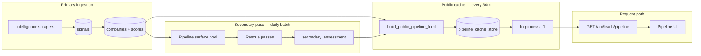

# Pipeline process and scripts

Reference for how the **public sales pipeline** is built, refreshed, enriched, and operated. For quality gates and secondary-pass pillars, see also [lead_quality_pipeline.md](lead_quality_pipeline.md) and [lead_secondary_pipeline.md](lead_secondary_pipeline.md).

**Product north star:** [lead_quality_north_star.md](lead_quality_north_star.md)

---

## End-to-end flow



| Stage | Purpose | Runs on request? |
|-------|---------|------------------|
| **Scrapers** | Coverage + new signals | No (scheduled / manual) |
| **Scoring** | `overall_intent_score`, tier (HOT/WARM/COLD) | No |
| **Secondary pass** | Enrich, rectification, `sales_opportunity_rank` | No (batch) |
| **Cache rebuild** | Pre-build homepage, summary, pipeline feed | No (background) |
| **GET /pipeline** | Serve cache + apply plan entitlements | Yes (read-only) |

**Rule:** `/api/leads/pipeline` never runs heavy SQL or OpenAI on the request path. It reads durable cache + in-memory L1, then trims by auth tier.

---

## Public pipeline feed

### Tier slots (production defaults)

Configured in `fly.toml` / env:

| Tier | Env | Default slots | Role |
|------|-----|---------------|------|
| HOT | `PIPELINE_HOT_SLOTS` | 15 | Act this week |
| WARM | `PIPELINE_WARM_SLOTS` | 20 | Nurture / sequence |
| Monitoring | `PIPELINE_MONITOR_SLOTS` | 15 | Watchlist (COLD) |
| **Total (paid)** | — | **50** | Full tiered feed |

Anonymous preview: **5 HOT + 4 WARM + 3 monitoring** (max **12**). Signed-in free/paid get the full slot mix.

Code: `app/services/plan_entitlements.py`, `app/api/leads.py` → `GET /api/leads/pipeline`.

### How leads are selected

`build_public_pipeline_feed()` in `app/api/leads.py`:

1. **`_fetch_staged_by_tier`** — for each tier, scan a bounded score-ranked pool, run **`classify_lead`**, drop junk.
2. **`blend_pipeline_rank_score`** — when `crm_metadata.secondary_assessment` exists, rank by:
   - 55% `sales_opportunity_rank`
   - 35% tier / priority score
   - 10% completeness
   - Unassessed leads keep tier score only (no penalty).
3. **Vertical diversity** — inject missing canonical industries into HOT/WARM when absent.
4. **`_fmt_pipeline_card`** — slim JSON for list UI; detail via `GET /api/leads/by-id/{id}`.

### What rotates vs what stays stable

| Surface | Rotation | Notes |
|---------|----------|-------|
| **`/api/leads/pipeline`** | Top names by blended rank | Same leaders until scores or assessment change |
| **Homepage spotlight** | **Daily** (6am Pacific) | `homepage_rotation` |
| **Lead list caches** (50/18/12) | Every **30 min** slot | `_rotate_staged_leads` |

`built_at` on the pipeline response = timestamp of last successful cache rebuild, not “discovered today.”

---

## Cache layers

| Layer | Storage | Key | TTL |
|-------|---------|-----|-----|
| **Durable** | Postgres `pipeline_cache_store` | `public:leads:pipeline:30:v1` | ~35 min (`PUBLIC_CACHE_TTL_MINUTES`) |
| **L1** | Process memory | `_PIPELINE_FEED_MEM` | Until rebuild / stale rejection |

Policy: `app/services/pipeline_cache_policy.py`

- **`PUBLIC_CACHE_REFRESH_INTERVAL_SEC`** — default **1800** (30 min)
- **`PUBLIC_CACHE_TTL_MINUTES`** — slightly longer than refresh so stale data serves during rebuild
- Stale durable feed → API returns `cache_pending: true`, empty leads (does not serve expired June-era snapshots)

### What gets rebuilt

`refresh_pipeline_surface_caches()` in `app/services/public_surface_cache.py`:

- Homepage payload (`resolve_llm_urls=False` on refresh — no OpenAI URL batch during rebuild)
- Summary (junk excluded + included)
- Rotated lead lists (50 / 18 / HOT-12)
- **Pipeline feed** (`build_public_pipeline_feed`)
- Humanoid report (optional; skipped on `pipeline_only=True`)

Triggers:

- 30-minute loop (web + worker startup after `PUBLIC_CACHE_STARTUP_DELAY_SEC`)
- Scraper completion → `pipeline_only` refresh
- Admin / cron refresh (see below)
- **After secondary pass batch** → full `refresh_pipeline_surface_caches()` + commit

---

## Secondary pass alignment

Secondary pass and `/pipeline` share the same candidate surface.

| Concern | Implementation |
|---------|----------------|
| **Batch pool** | `select_pipeline_surface_company_ids()` — HOT/WARM/COLD via `_fetch_staged_by_tier`, **4×** slot width (default cap 120) |
| **Gap audit filter** | `SECONDARY_PASS_SALES_LEADS_ONLY=1` → pipeline pool + `classify_lead` gate |
| **Persisted rank** | `crm_metadata.secondary_assessment.pillars.opportunity_rank` |
| **Post-batch cache** | `run_secondary_pass_batch_and_refresh_caches()` rebuilds pipeline caches |

Production schedule (`fly.toml`):

- `ENABLE_SCHEDULED_SECONDARY_PASS=1`
- Every **24h**, first run **60 min** after deploy
- `SECONDARY_PASS_LIMIT=120`, `SECONDARY_PASS_MIN_SCORE=15`

Full pillar / rescue-pass detail: [lead_secondary_pipeline.md](lead_secondary_pipeline.md).

---

## API endpoints

### Public

| Method | Path | Purpose |
|--------|------|---------|
| GET | `/api/leads/pipeline` | Tiered pipeline feed (cache-backed) |
| GET | `/api/leads/by-id/{id}` | Full lead card |
| GET | `/api/leads/homepage` | Homepage summary + spotlight |
| GET | `/health` | Liveness |

### Admin (`X-Admin-Key` or admin JWT)

| Method | Path | Purpose |
|--------|------|---------|
| POST | `/api/admin/leads/refresh-pipeline-cache` | Rebuild pipeline/homepage caches (daemon thread) |
| POST | `/api/admin/leads/secondary-pass` | Run lead secondary batch |
| POST | `/api/admin/leads/refresh-inference` | Re-infer top pipeline companies |
| POST | `/api/admin/leads/enrich-agent` | Agent enrichment batch |

### Cron / ops (`X-Admin-Key` **or** `SCRAPER_CRON_TOKEN`)

| Method | Path | Purpose |
|--------|------|---------|
| GET | `/api/scraper/cron/refresh-pipeline` | Pipeline cache rebuild |
| GET | `/api/scraper/cron/run-secondary-pass` | Lead secondary pass |
| GET | `/api/scraper/cron/run-secondary-pipeline` | Leads + humanoids (serialized) |
| GET | `/api/scraper/secondary-pass/status` | In-progress / last run stats (per process) |

**Note:** `secondary-pass/status` on the **web** machine is often empty; job state lives on the worker process that ran the job.

---

## Scripts reference

Run from repo root unless noted. Most scripts load `.env` and `frontend/nextjs/.env.local` for `DATABASE_URL`.

### Pipeline cache and diagnostics

| Script | Purpose |
|--------|---------|
| `scripts/refresh_pipeline_cache.py` | Local DB rebuild, or `--remote` → admin/cron refresh on Fly |
| `scripts/run_refresh_pipeline_cache.sh` | Shell wrapper for refresh script |
| `scripts/diagnose_pipeline.py` | End-to-end check: DB → Fly API → Vercel proxy |
| `scripts/monitor_pipeline.sh` | Lightweight production monitor |
| `scripts/audit_pipeline.py` | Legacy DB audit (may reference old `leads` table — prefer `diagnose_pipeline.py`) |

```bash
# Local rebuild (uses DATABASE_URL — typically same Supabase as prod)
python3 scripts/refresh_pipeline_cache.py

# Trigger Fly rebuild without local heavy work
python3 scripts/refresh_pipeline_cache.py --remote

# Full stack diagnostic
python3 scripts/diagnose_pipeline.py
python3 scripts/diagnose_pipeline.py --production-only
```

### Secondary pass

| Script | Purpose |
|--------|---------|
| `scripts/run_lead_secondary_pass.py` | Manual gap-driven rescue batch |
| `scripts/run_secondary_pipeline_report.py` | Combined leads + humanoids audit/report |

```bash
# Audit candidates only (no writes)
PYTHONPATH=. python3 scripts/run_lead_secondary_pass.py --audit-only --limit 30

# Run batch (pipeline sales-lead filter on by default)
PYTHONPATH=. python3 scripts/run_lead_secondary_pass.py --limit 25 --no-rescore

# Faster manual run
PYTHONPATH=. python3 scripts/run_lead_secondary_pass.py --limit 50 \
  --no-signal-backfill --no-apollo --no-llm --cooldown-hours 0

# Include junk/Unknown headline rows (not recommended for prod)
PYTHONPATH=. python3 scripts/run_lead_secondary_pass.py --all-leads --limit 20

# Combined secondary report
python3 scripts/run_secondary_pipeline_report.py --audit-only
```

### Quality / cleanup (feeds pipeline indirectly)

| Script | Purpose |
|--------|---------|
| `scripts/evaluate_pipeline_leads.py` | Relevancy eval CSV; optional `--apply` renames/industry |
| `scripts/cleanup_pipeline_junk.py` | Junk audit CSV; hard delete only with strict flags |
| `scripts/cleanup_leads.py` | **Preferred** production cleanup + profile rebuild |
| `scripts/purge_junk_leads.py` | Regex junk purge |
| `scripts/reclassify_mislabeled_leads.py` | Industry reclassification batch |

Reports land in `reports/` — generated artifacts; do not commit.

---

## Production operations (Fly)

**App:** `ready-2-robot`  
**URL:** https://ready-2-robot.fly.dev  
**Machines:** `web` (HTTP) + `worker` (schedulers, interval refresh)

```bash
# Deploy
fly deploy -a ready-2-robot

# Ensure worker is running (schedulers + 30m cache loop)
fly machine list -a ready-2-robot
fly scale count worker=1 web=1 -a ready-2-robot

# Logs
fly logs -a ready-2-robot
```

### Verify pipeline health

```bash
curl -s "https://ready-2-robot.fly.dev/health"

curl -s "https://ready-2-robot.fly.dev/api/leads/pipeline" | python3 -c "
import json, sys
d = json.load(sys.stdin)
print('built_at', d.get('built_at'))
print('cache_pending', d.get('cache_pending'))
print('leads', len(d.get('leads') or []))
for l in (d.get('leads') or [])[:5]:
    print(' ', l.get('priority_tier'), l.get('company_name'))
"
```

Expect: fresh `built_at`, no `cache_pending`, leads > 0. Anonymous curl shows up to **12** leads; durable cache holds **50**.

### Trigger refresh / secondary pass (requires secrets from Fly or local `.env`)

```bash
source .env

# Rebuild pipeline cache
curl -X POST "https://ready-2-robot.fly.dev/api/admin/leads/refresh-pipeline-cache" \
  -H "X-Admin-Key: $ADMIN_KEY"

# Secondary pass (then auto cache rebuild)
curl -X POST "https://ready-2-robot.fly.dev/api/admin/leads/secondary-pass?limit=50" \
  -H "X-Admin-Key: $ADMIN_KEY"

# Cron-style (token on Fly only unless exported locally)
curl "https://ready-2-robot.fly.dev/api/scraper/cron/refresh-pipeline" \
  -H "X-Admin-Key: $ADMIN_KEY"
```

**Do not** run local `refresh_pipeline_cache.py` and Fly admin refresh **at the same time** — they compete for Supabase pool slots and can wedge the web machine.

---

## Key environment variables

| Variable | Default | Effect |
|----------|---------|--------|
| `PIPELINE_HOT_SLOTS` / `WARM` / `MONITOR` | 15 / 20 / 15 | Tier slot counts |
| `PIPELINE_SUMMARY_ROW_CAP` | 2000 | Max rows for summary/homepage slice |
| `PUBLIC_CACHE_REFRESH_INTERVAL_SEC` | 1800 | Cache rebuild interval |
| `PUBLIC_CACHE_TTL_MINUTES` | ~35 | Durable cache expiry |
| `PUBLIC_CACHE_STARTUP_DELAY_SEC` | 300 (Fly) | Defer first rebuild after deploy |
| `SECONDARY_PASS_SALES_LEADS_ONLY` | 1 | Secondary pool = pipeline surface |
| `SECONDARY_PASS_LIMIT` | 120 | Daily batch size |
| `COMPANY_URL_OPENAI_RESOLVE` | off on refresh | LLM homepage resolve (disabled during cache rebuild) |

Secrets (Fly / local `.env`): `DATABASE_URL`, `ADMIN_KEY`, `SCRAPER_CRON_TOKEN`, `OPENAI_API_KEY`, etc.

---

## Key code files

| Area | Path |
|------|------|
| Pipeline feed build | `app/api/leads.py` — `build_public_pipeline_feed`, `_fetch_staged_by_tier` |
| Surface company IDs | `app/services/pipeline_inference_batch.py` — `select_pipeline_surface_company_ids` |
| Blend ranking | `app/services/lead_secondary_assessment.py` — `blend_pipeline_rank_score` |
| Cache refresh | `app/services/public_surface_cache.py` |
| Durable store | `app/services/pipeline_cache_store.py` |
| Cache policy | `app/services/pipeline_cache_policy.py` |
| Plan caps | `app/services/plan_entitlements.py` |
| Gap audit / pool | `app/services/lead_gap_audit.py` |
| Secondary orchestrator | `app/services/lead_secondary_pass.py` |
| Job runner | `app/services/secondary_pass_runner.py` |
| Admin routes | `app/api/admin_lead_ops.py` |
| Cron routes | `app/api/scraper_control.py` |

---

## Troubleshooting

| Symptom | Likely cause | Action |
|---------|--------------|--------|
| `built_at: None`, `cache_pending: true`, 0 leads | Stale/missing cache or hung rebuild | Check Fly logs; **one** refresh via admin; confirm worker running |
| Same names for days on `/pipeline` | Expected — top rank stable | Scores/assessment must change; not daily rotation |
| `built_at` old but leads present | TTL serving during failed rebuild | Fix rebuild errors (regex/LLM hangs fixed in `0c18966+`) |
| Secondary status null on web | Status is in-memory per process | Check worker logs or DB `secondary_assessment.assessed_at` |
| Local refresh hangs minutes+ | Competing refreshes or regex backtrack | Kill `pkill -f refresh_pipeline`; single refresh only |
| 9 leads on curl, 50 in product | Anonymous entitlement cap | Sign in or use admin/authed client |

### Quick DB checks (local with `DATABASE_URL`)

```bash
python3 - <<'PY'
import json
from sqlalchemy import text
from app.database import SessionLocal
db = SessionLocal()
row = db.execute(text("""
  select built_at, jsonb_array_length(data->'leads') as n
  from pipeline_cache_store
  where cache_key = 'public:leads:pipeline:30:v1'
""")).fetchone()
print("cache:", row.built_at, "leads:", row.n)
db.close()
PY
```

---

## Related docs

- [lead_quality_pipeline.md](lead_quality_pipeline.md) — junk filter, logic engine, ingestion gates
- [lead_secondary_pipeline.md](lead_secondary_pipeline.md) — five pillars, rescue passes, schedules
- [lead_quality_north_star.md](lead_quality_north_star.md) — product principles
- [lead_quality_blind_spots.md](lead_quality_blind_spots.md) — known quality gaps

---

*Last updated: 2026-06-21 — reflects pipeline/secondary alignment (`8883f7f`) and cache refresh fixes (`0c18966`).*
