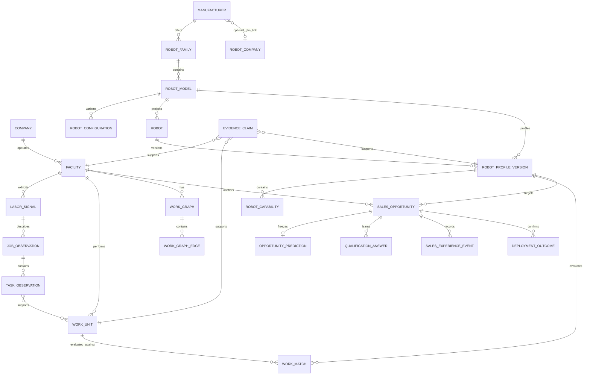

# V1 Data Model

## Design Rules

- PostgreSQL is authoritative; SQLAlchemy models retain SQLite variants for focused tests.
- Existing integer IDs on `companies`, `signals`, and `robots` remain unchanged.
- New domain entities use UUID primary keys generated by PostgreSQL.
- Every foreign key used for joins has an index.
- Mutable current state and immutable history are separate.
- Structured, frequently filtered values are columns. Variable physical specifications and evidence payloads use JSONB.
- Timestamps are timezone-aware.
- Money uses `numeric`, never floating point.
- Deletion is restrictive for truth-bearing records. Historical labor signals and predictions are never cascade-deleted through normal product actions.

## Entity Relationship

Catalog hierarchy detail: [robot_catalog_hierarchy.md](robot_catalog_hierarchy.md).

## Shared Vocabulary

### Truth State

| Value | Meaning |
| --- | --- |
| `observed` | Directly present in a public source or user action |
| `inferred` | Derived by rules or model and not independently confirmed |
| `oem_verified` | Confirmed by an authorized robot-company user |
| `customer_confirmed` | Confirmed by the facility/customer |
| `site_verified` | Verified through physical site review |
| `deployment_verified` | Verified through pilot or production outcome |
| `unknown` | Explicitly not known |

### Opportunity Truth State

`discovered`, `matched`, `prioritized`, `contacted`, `engaged`, `qualified`, `site_review`, `pilot`, `deployed`

### Opportunity Disposition

`active`, `watch`, `paused`, `lost`

### Call Priority

`call_now`, `qualify`, `watch`, `wrong_robot`, `insufficient_evidence`, `do_not_surface`

`unresolvable` is represented as `insufficient_evidence` with reason code `account_unresolvable`, matching the V1 customer vocabulary.

## Existing Tables Reused

### `companies`

Parent commercial/legal identity. Keep current columns. Do not use company location fields as facility truth after backfill.

### `signals`

Raw source observation retained for compatibility. Add nullable `facility_id`, `source_observed_at`, `first_seen_at`, `last_seen_at`, and `is_active`. Historical rows remain queryable after a posting disappears.

### `robots`

Legacy integer catalog projection. Authoritative product identity is `manufacturers` → `robot_families` → `robot_models` → `robot_configurations`. Specs live in immutable `robot_profile_versions`. `robots` retains FKs (`manufacturer_id`, `robot_model_id`, `robot_configuration_id`) for URL-analysis continuity.

### `manufacturers` / `robot_families` / `robot_models` / `robot_configurations`

Product catalog hierarchy (not GTM). `robot_models` is the primary Work Match unit and carries `commercial_maturity`, buyability fields, `calibration_tier`, and `primary_class`. See [robot_catalog_hierarchy.md](robot_catalog_hierarchy.md).

### `sales_opportunities`

Permanent opportunity identity and current state. Add:

- `facility_id uuid null`
- `robot_profile_version_id uuid null`
- `disposition text not null default 'active'`
- `public_id text unique null`

Retain `payload` for compatibility, but new queried identity must use columns.

### `sales_experience_events`

Append-only lifecycle and outcome ledger. Prediction, qualification, and transition services continue to write canonical events.

## New Tables

### `facilities`

| Column | Type | Rule |
| --- | --- | --- |
| `id` | uuid | primary key |
| `company_id` | integer | required FK to `companies`, restrict delete |
| `name` | text | nullable until resolved |
| `address_line_1` | text | nullable |
| `address_line_2` | text | nullable |
| `city`, `state_region`, `postal_code`, `country_code` | text | country uses ISO-2 when known |
| `normalized_address` | text | resolver output |
| `location_precision` | text | `exact`, `city`, `region`, `unknown` |
| `facility_type`, `industry` | text | nullable |
| `estimated_size` | jsonb | value, unit, range, provenance refs |
| `known_equipment`, `known_robots`, `contact_roles` | jsonb | arrays, default `[]` |
| `confidence` | numeric(5,4) | 0 through 1 |
| `truth_state` | text | shared vocabulary |
| `first_seen_at`, `last_seen_at`, `created_at`, `updated_at` | timestamptz | required except updated |

Uniqueness is resolver-controlled. Use a partial unique index on `(company_id, normalized_address)` where `normalized_address is not null`; unresolved facilities may coexist until merged.

### `evidence_claims`

Field-level provenance used by all engines.

| Column | Type | Rule |
| --- | --- | --- |
| `id` | uuid | primary key |
| `entity_type` | text | `robot_profile`, `facility`, `labor_signal`, `work_unit`, `work_match`, `opportunity`, `deployment` |
| `entity_id` | text | canonical ID serialized for polymorphic linkage |
| `field_path` | text | e.g. `payload.max_kg` |
| `value` | jsonb | typed claim value |
| `truth_state` | text | required |
| `source_type`, `source_url`, `source_id` | text | source identity |
| `excerpt` | text | source support, nullable |
| `observed_at`, `recorded_at` | timestamptz | required |
| `confidence` | numeric(5,4) | 0 through 1 |
| `supersedes_claim_id` | uuid | nullable self-FK; old claim remains |
| `recorded_by_user_id` | uuid | nullable FK |

Index `(entity_type, entity_id, field_path, recorded_at desc)` and `source_id`. Do not update claim values; append a superseding claim.

### `labor_signals`

A durable time-series cluster of repeated facility work demand.

| Column | Type | Rule |
| --- | --- | --- |
| `id` | uuid | primary key |
| `facility_id` | uuid | required FK |
| `legacy_signal_id` | integer | nullable FK to `signals` |
| `job_title`, `job_family` | text | nullable |
| `source_type`, `source_url`, `source_fingerprint` | text | fingerprint required for dedupe |
| `posting_date`, `first_seen_at`, `last_seen_at` | timestamptz | first and last required |
| `is_active` | boolean | default true |
| `shift`, `employment_type` | text | nullable |
| `wage_min`, `wage_max`, `shift_differential`, `signing_bonus` | numeric(12,2) | nullable |
| `currency` | text | ISO-4217 when money exists |
| `openings` | integer | nullable, nonnegative |
| `description` | text | source-preserving text |
| `signal_strength` | numeric(5,2) | 0 through 100 |
| `confidence` | numeric(5,4) | 0 through 1 |
| `truth_state` | text | observed or inferred |

Unique `(facility_id, source_fingerprint)`. Index `(facility_id, job_family, first_seen_at)` and active rows by `(facility_id, last_seen_at desc) where is_active`.

### `job_observations`

Normalized job snapshot extracted from a labor signal. Fields: UUID ID, `labor_signal_id`, title, family, shift, description, extraction version, extracted timestamp, and JSONB structured terms.

### `task_observations`

Source-grounded task fragments. Fields: UUID ID, `job_observation_id`, sequence, action, object, origin, destination, source excerpt, extraction version, confidence, and truth state.

### `work_units`

| Column | Type | Rule |
| --- | --- | --- |
| `id` | uuid | primary key |
| `facility_id` | uuid | required FK |
| `name`, `task` | text | required |
| `origin`, `destination`, `object_name` | text | nullable |
| `action_chain` | jsonb | ordered array, default `[]` |
| `payload`, `distance`, `frequency`, `duration` | jsonb | value/range/unit/claims |
| `shift`, `environment`, `traffic`, `variability`, `human_interaction` | jsonb/text | unknown permitted |
| `estimated_work_share` | numeric(5,4) | nullable, 0 through 1 |
| `automation_mode` | text | `replace`, `transfer`, `expand`, `cover`, `protect`, `safety` |
| `replacement_mode` | text | `replacement`, `augmentation`, `capacity`, `coverage`, `resilience`, `safety` |
| `unknowns`, `blockers` | jsonb | arrays, default `[]` |
| `confidence` | numeric(5,4) | 0 through 1 |
| `truth_state` | text | required |
| `created_at`, `updated_at` | timestamptz | required |

A join table `task_work_unit_evidence(task_observation_id, work_unit_id, claim_id)` preserves extraction lineage.

### `work_graphs` and `work_graph_edges`

`work_graphs` stores facility, name, version, confidence, truth state, and timestamps. `work_graph_edges` stores graph ID, sequence, source node, target node, material/object, work-unit FK, branch label, and claim IDs. Nodes are JSONB typed references in V1. No graph database is introduced.

### `robot_profile_versions`

Immutable OEM/work-envelope snapshot.

| Column | Type | Rule |
| --- | --- | --- |
| `id` | uuid | primary key |
| `robot_id` | integer | required FK to `robots` |
| `version` | integer | required, unique per robot |
| `source_url` | text | required for URL ingestion |
| `manufacturer`, `model`, `category` | text | category constrained to V1 wedge |
| `work_envelope`, `physical_capabilities` | jsonb | structured values with claim refs |
| `commercial_status`, `service_geography` | jsonb/text | nullable |
| `verification_state` | text | shared truth state |
| `confidence` | numeric(5,4) | 0 through 1 |
| `created_by_user_id` | uuid | nullable |
| `created_at` | timestamptz | required |
| `supersedes_version_id` | uuid | nullable self-FK |

Never update a verified version. Corrections create a new version and OEM-verified claims.

### `robot_capabilities`

Normalized filterable capabilities: profile version FK, capability key, operator, numeric value, text value, unit, constraints JSONB, truth state, confidence, claim IDs. Unique `(robot_profile_version_id, capability_key)`.

### `work_matches`

One versioned evaluation per Work Unit and robot profile.

Columns: UUID ID, work-unit FK, profile-version FK, evaluation version, internal score 0-100, customer label, confidence, hard-blocker boolean, matched/unknown/incompatible constraints JSONB, throughput assessment, intervention assessment, and timestamp.

Customer label is `excellent`, `good`, `possible`, `poor`, or `insufficient_information`. If `has_hard_blocker = true`, Call Priority cannot be `call_now` or `qualify` for this robot.

### `opportunity_predictions`

Immutable one-to-one T0 record.

| Column | Type | Rule |
| --- | --- | --- |
| `id` | uuid | primary key |
| `sales_opportunity_id` | uuid | unique required FK |
| `facility_id`, `robot_profile_version_id` | uuid | required FKs |
| `work_unit_ids`, `labor_signal_ids` | jsonb | nonempty arrays |
| `work_match`, `labor_pressure`, `operational_exposure`, `buyability`, `deployability`, `evidence_confidence`, `account_resolvability` | jsonb | score/label/confidence/reasons |
| `call_priority` | text | required |
| `automation_theses` | jsonb | nonempty array |
| `known_facts`, `inferences`, `unknowns`, `blockers`, `qualification_question_ids` | jsonb | arrays |
| `model_version`, `rules_version` | text | required |
| `predicted_at` | timestamptz | required |

Application and database permissions disallow update/delete. A recalculation after T0 is an experience event, not a new T0 prediction.

### `qualification_questions`

Versioned question library: key, robot category, prompt, answer type, unit, options, affected dimensions, required evidence state, hard-blocker rules, information-value rule, active version.

### `qualification_answers`

Append-only answer record: opportunity FK, question FK, answer JSONB, answer state (`known`, `unknown`, `not_applicable`, `conflicting`), truth state, confidence, source, claim ID, user, and recorded timestamp. A correction supersedes, never updates, an earlier answer.

### `deployment_outcomes`

Optional V1 outcome snapshot linked to an event: opportunity FK, robot profile version, facility, workflow/work-unit IDs, outcome type (`pilot`, `production`, `expanded`, `failed`), units deployed, pilot/deployment dates, expected/actual volume and uptime, labor before/after, throughput before/after, human intervention, costs, payback, expansion fields, truth state, confidence, and claim IDs.

Most values are nullable in V1. `outcome_type`, opportunity, facility, robot, truth state, and timestamp are required.

## State Storage

`SalesOpportunity.current_stage` stores the monotonic truth state. `SalesOpportunity.disposition` stores `active`, `watch`, `paused`, or `lost`.

Examples:

- PRIORITIZED + WATCH: `current_stage='prioritized'`, `disposition='watch'`
- CONTACTED then paused: `current_stage='contacted'`, `disposition='paused'`
- QUALIFIED then lost: `current_stage='qualified'`, `disposition='lost'`, plus controlled loss event

This prevents WATCH/PAUSED from erasing how much truth was established.

## Migration Order

1. Create `facilities` and `evidence_claims`.
2. Create labor, job, task, Work Unit, and Work Graph tables.
3. Create robot profile and capability tables; backfill one version per supported robot.
4. Create Work Match and qualification tables.
5. Add facility/profile/disposition/public-ID columns to `sales_opportunities`.
6. Create immutable `opportunity_predictions` and `deployment_outcomes`.
7. Backfill exact-enough legacy company locations into facilities with `truth_state='inferred'` unless directly sourced.
8. Dual-read old JSON and new tables for one release; write only new tables for V1 routes.
9. Switch V1 reads to new tables. Keep legacy routes until usage reaches zero.

## Required Constraints And Indexes

- Check all confidence values between 0 and 1 and scores between 0 and 100.
- Check money pairs for currency when non-null.
- Check `last_seen_at >= first_seen_at`.
- Check allowed truth states, labels, dispositions, and priorities.
- Index every FK.
- Composite index opportunities on `(team_id, disposition, current_stage, updated_at desc)`.
- Partial index active labor signals and active opportunities.
- Unique partial index for resolved facility address.
- Unique opportunity prediction per opportunity.
- Prevent prediction updates with restricted DB role and an update/delete trigger as defense in depth.

## Tenant And Access Boundary

Public anonymous analysis may read only robot profiles and redacted ranked opportunity summaries produced for its analysis job. Team-owned corrections, saved opportunities, qualification answers, and outcomes require membership checks through the existing team/auth layer. Source excerpts containing contact details are not public by default.
